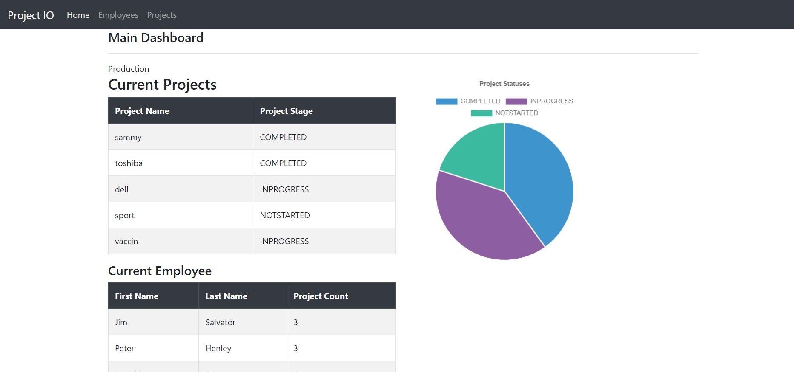

# Project management webapp

A Spring MVC web application for project management. The application backend is written in java and contains authentication via Spring Security and also a RestAPI point. The frontend is written in Thymleaf .

## Authors

- [@SamiHasAb](https://github.com/SamiHasAb)

  
## Screenshots

  
